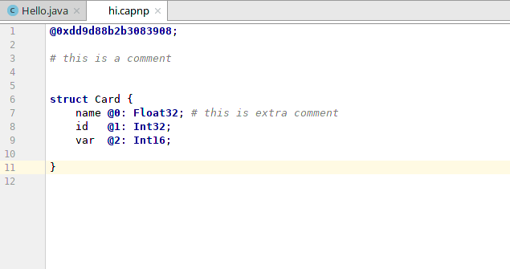
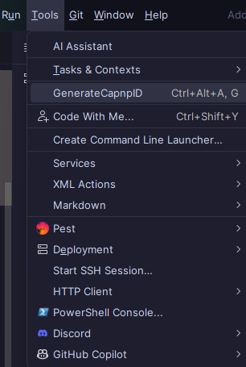

# sercapnp
Capnp support for intellij

## About

### What is Capnp or Cap'n proto?
Cap’n Proto is an insanely fast data interchange format and capability-based RPC system. Think JSON, except binary. Or think Protocol Buffers, except faster. In fact, in benchmarks, Cap’n Proto is INFINITY TIMES faster than Protocol Buffers.
https://capnproto.org/

### Syntax Highlighting



### Generating IDs
From tools menu -> Generate capnp id or Ctrl+Alt+A then G

## Building

The plugin can be built using Gradle.

```
./gradlew buildPlugin
```

The plugin JAR can then be found in `build/libs/sercapnp-VERSION.jar`.
