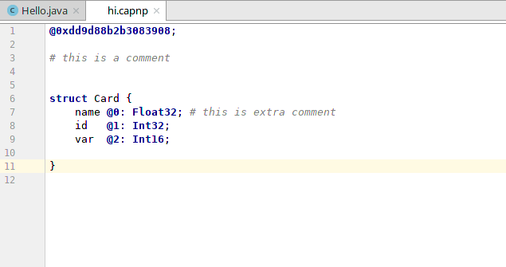
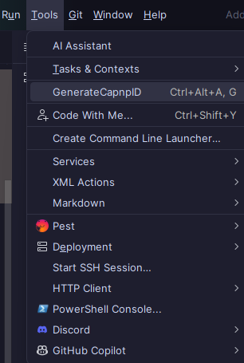

# SerCapnp

Cap'n Proto language support for IntelliJ-based IDEs (IntelliJ IDEA, WebStorm, PyCharm, CLion, etc.)

## About Cap'n Proto

[Cap'n Proto](https://capnproto.org/) is an insanely fast data interchange format and capability-based RPC system. Think JSON, except binary. Or think Protocol Buffers, except faster.

## Features

- **Syntax highlighting** — keywords, built-in types, identifiers, strings, numbers, constants (`true`/`false`/`void`), comments, unique IDs (`@0x...`), and ordinals (`@0`, `@1`, ...)
- **Bracket matching** — auto-matching for `{}`, `[]`, `()`
- **Comment toggling** — Ctrl+/ to toggle `#` line comments
- **Code folding** — collapse struct, enum, and interface blocks
- **Cap'n Proto ID generation** — generate unique 64-bit schema IDs from Tools menu or Ctrl+Alt+A then G
- **New file action** — File → New → Capnp File
- **Color settings** — fully customizable colors via Settings → Editor → Color Scheme → Cap'n Proto

### Supported Token Types

| Token | Examples |
|-------|---------|
| Keywords | `struct`, `enum`, `union`, `interface`, `const`, `annotation`, `using`, `import`, `extends` |
| Built-in Types | `Void`, `Bool`, `Int8`–`Int64`, `UInt8`–`UInt64`, `Float32`, `Float64`, `Text`, `Data`, `List`, `AnyPointer`, `group` |
| Constants | `true`, `false`, `void`, `inf`, `nan` |
| Unique IDs | `@0x85150b117366d14b` |
| Ordinals | `@0`, `@1`, `@42` |
| Strings | `"hello world"` |
| Numbers | `42`, `0xFF`, `3.14` |

### Syntax Highlighting



### Generating IDs



From Tools menu → Generate capnp id, or Ctrl+Alt+A then G.

## Building

The plugin can be built using Gradle:

```bash
./gradlew buildPlugin
```

The plugin ZIP can then be found in `build/distributions/`.

## Installation

1. Build the plugin with `./gradlew buildPlugin`
2. In your JetBrains IDE, go to Settings → Plugins → ⚙️ → Install Plugin from Disk...
3. Select the ZIP from `build/distributions/`
4. Restart the IDE

## Compatibility

- IntelliJ Platform 2022.1+ (build 221+)
- All JetBrains IDEs (IntelliJ IDEA, WebStorm, PyCharm, CLion, GoLand, etc.)

## License

BSD 3-Clause. See [LICENSE](LICENSE).

## Development

See DEVELOPING.md for instructions on developing, testing, running, and publishing the plugin.
